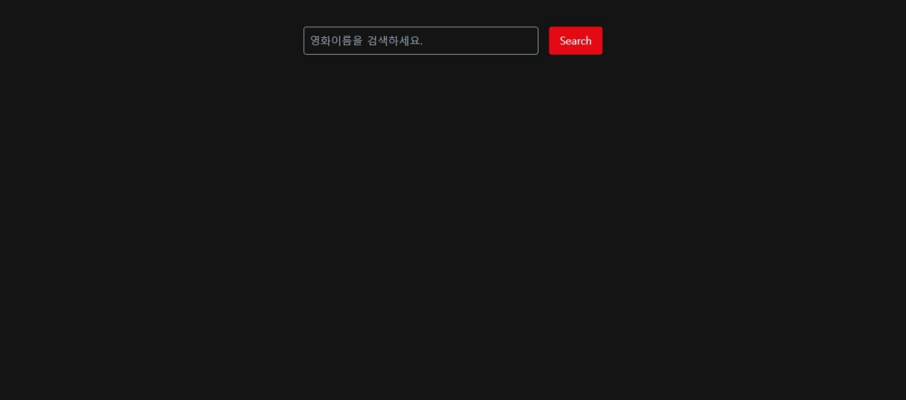
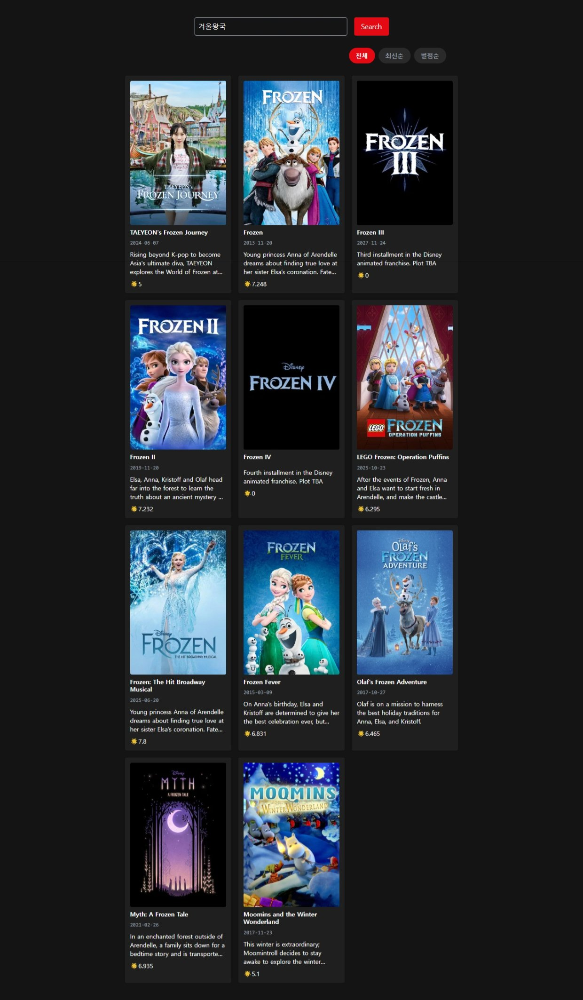
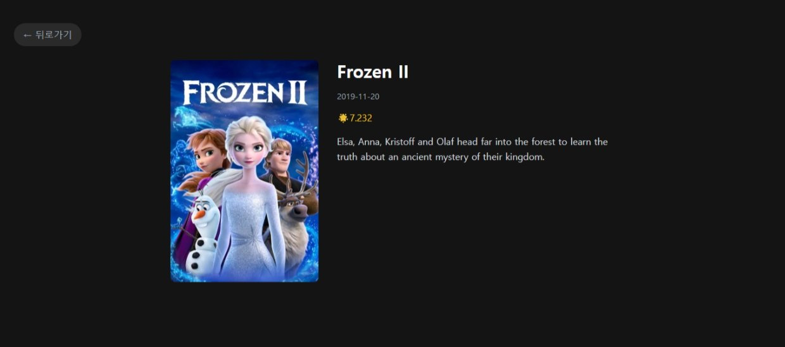

# 🎬 CineSearch

> TMDB API 기반 영화 검색 및 상세 정보 조회 앱

   

---

## 📎 배포 링크

🔗 [CineSearch 바로가기](https://movie-app-zeta-ruby.vercel.app)

---

## 📸 화면 구성

| 홈 | 검색 결과 | 상세 페이지 |
|---|---|---|
|  |  |  |

---

## 📌 주요 기능

- 키워드로 영화 검색 (엔터 / 버튼 모두 지원)
- 검색 결과를 전체 / 최신순 / 별점순으로 정렬
- 로딩 중 스켈레톤 UI로 레이아웃 유지
- 영화 클릭 시 상세 페이지로 이동
- 상세 페이지에서 포스터, 개봉일, 평점, 줄거리 확인
- API 실패 / 검색 결과 없음 예외 처리

---

## 🛠 기술 스택

| 역할 | 기술 |
|---|---|
| UI | React 18 |
| 언어 | TypeScript |
| 스타일 | Tailwind CSS |
| 라우팅 | React Router v6 |
| API | TMDB REST API |

---

## 📁 프로젝트 구조

```
src/
├── components/
│   ├── MovieItem.tsx       # 영화 카드 컴포넌트
│   ├── MovieList.tsx       # 영화 목록 그리드
│   ├── MovieSkeleton.tsx   # 스켈레톤 로딩 UI
│   └── SearchBar.tsx       # 검색 입력 + 버튼
├── hooks/
│   ├── useMovies.ts        # 검색 / 정렬 로직
│   └── useMovieDetail.ts   # 상세 정보 fetch 로직
├── pages/
│   ├── Home.tsx            # 검색 메인 페이지
│   └── MovieDetail.tsx     # 영화 상세 페이지
└── types/
    └── movie.ts            # 타입 정의
```

---

## 🔧 구현 포인트

### Discriminated Union으로 fetch 상태 관리

`isLoading`, `isError` 같은 boolean 플래그를 여러 개 관리하면 상태 조합이 늘어날수록 예외 케이스가 생깁니다. fetch 상태를 `idle | loading | success | error` 유니온 타입 하나로 정의해 상태가 명확히 분리되도록 했고, `success` 상태일 때만 `data`에 접근할 수 있어 런타임 에러를 타입 레벨에서 방지했습니다.

```ts
type FetchState =
  | { status: "idle" }
  | { status: "loading" }
  | { status: "success"; data: IMoviesProps[] }
  | { status: "error"; error: string };
```

---

### 커스텀 훅으로 로직과 UI 분리

컴포넌트 안에 fetch 로직이 섞이면 UI 수정과 로직 수정이 서로 영향을 주게 됩니다. `useMovies`와 `useMovieDetail`로 로직을 분리해 컴포넌트는 렌더링에만 집중하도록 했습니다.

특히 `useMovieDetail`은 `id`를 훅 내부에서 `useParams()`로 직접 가져오지 않고 외부에서 주입받도록 설계했습니다. 훅이 URL 구조에 의존하게 되면 `/movie/:id` 라우트 밖에서는 재사용이 불가능해지기 때문입니다.

```ts
// id가 어디서 왔는지는 훅이 알 필요 없음
// URL이든, props든 동일하게 동작
export function useMovieDetail(id: string) { ... }
```

---

### 스켈레톤 UI로 로딩 경험 개선

데이터를 불러오는 동안 빈 화면이 보이면 사용자 입장에서 앱이 멈춘 것처럼 느껴집니다. 실제 카드와 동일한 레이아웃의 스켈레톤 컴포넌트를 만들어 로딩 중에도 화면 구조가 유지되도록 했고, Tailwind의 `animate-pulse`로 자연스러운 로딩 피드백을 제공했습니다.

---

### 한글 검색어 안전 처리

TMDB API에 한글 키워드를 그대로 URL에 넣으면 인코딩 문제로 검색이 실패할 수 있습니다. `encodeURIComponent`를 적용해 한글을 포함한 모든 키워드가 올바르게 전달되도록 했습니다.

```ts
`https://api.themoviedb.org/3/search/movie?query=${encodeURIComponent(keyword)}`
```

---

### 포스터 없는 영화 예외 처리

TMDB 데이터 중 `poster_path`가 `null`인 경우가 있습니다. 이미지가 없을 때 깨진 UI 대신 대체 텍스트를 보여주도록 처리해 어떤 데이터에서도 레이아웃이 유지됩니다.

---

## 🚀 시작하기

```bash
# 패키지 설치
npm install

# 개발 서버 실행
npm run dev
```

루트에 `.env` 파일 생성 후 아래 내용 추가

```
VITE_TMDB_ACCESS_TOKEN=your_token_here
```

> TMDB API 토큰은 [https://www.themoviedb.org](https://www.themoviedb.org) 에서 발급받을 수 있습니다.
